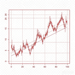
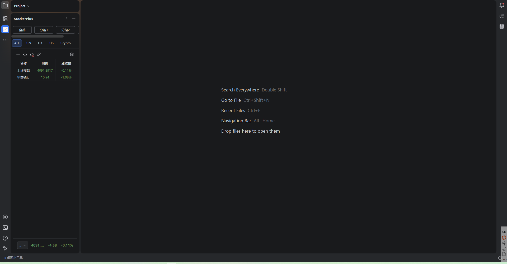
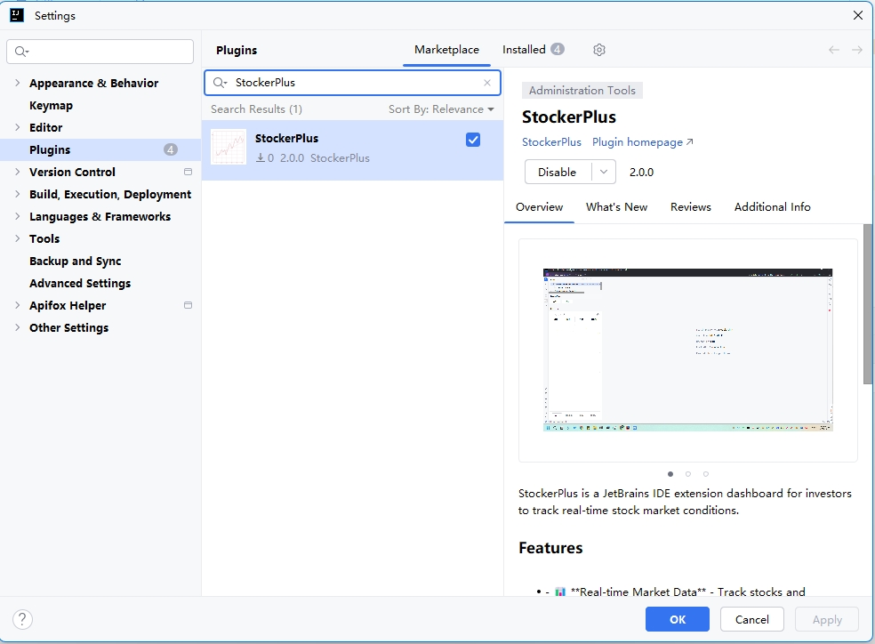

<h1 align="center">
<br>
StockerPlus
</h1>

<p align="center">
StockerPlus is a JetBrains IDE extension dashboard for investors to track real-time stock market conditions.
</p>
<p align="center">
</p>
<p align="center">

</p>


## ✨ Features

- 📊 **Real-time Market Data** - Track stocks and cryptocurrencies with live updates
- 🎨 **Customizable Display** - Choose from multiple color patterns and customize visible table columns
- 🔤 **Pinyin Support** - Display stock names in Pinyin for easier reading
- 📈 **Sortable Columns** - Three-state sorting (ascending, descending, unsorted) on any column
- 🪙 **Cryptocurrency Support** - Monitor crypto assets alongside traditional securities
- 🎯 **Custom Stock Names** - Set custom names for your favorite stocks
- 🔍 **Smart Search** - Quickly find and add stocks with intelligent search dialog
- 📋 **Batch Operations** - Manage multiple stocks at once with batch add and delete and reorder
- 💾 **Persistent Settings** - Your preferences and watchlist are saved across IDE sessions
- 📦 **Stock Groups Operations** - Manage stock groups
- 🌐 **F10 Stock Detail** - Open stock detail page in browser with F10 key


## 📊 Supported Markets

- **A-Shares** - Shanghai Stock Exchange (SSE) & Shenzhen Stock Exchange (SZSE)
- **Hong Kong Stocks** - Hong Kong Stock Exchange (HKEX)
- **US Stocks** - NASDAQ, NYSE, and other US exchanges
- **Cryptocurrencies** - Major crypto assets

## 🚀 Quick Start

1. **Install the Plugin**
   - Open `Settings/Preferences` → `Plugins` → `Marketplace`
   - Search for **StockerPlus** and click `Install`

   

2. **Open StockerPlus Tool Window**
   - Find the **StockerPlus** tool window in the left or right sidebar
     - Click to open the dashboard

3. **Add Your Stocks**
   - Click the **Add Favorite Stocks** button (🔍 search icon)
   - Search for stocks by name or code
   - Select and add to your watchlist

4. **Customize Settings**
   - Go to `Settings/Preferences` → `Tools` → `StockerPlus`
   - Configure color patterns, display columns, pinyin mode, and more

5. **Start Tracking**
   - Watch your investments update in real-time
   - Sort, filter, and manage your watchlist as needed

## 🔨 Build

**Prerequisites:** JDK 21

```bash
# Set JDK 21 environment (adjust path as needed)
export JAVA_HOME="/path/to/jdk-21"

# Compile only (fast check)
./gradlew compileKotlin compileJava

# Run unit tests
./gradlew test

# Full build (compile + test + package)
./gradlew build

# Build distributable plugin zip
./gradlew clean buildPlugin
```

Output: `build/distributions/intellij-stock-dashboard-{version}.zip`

Install: `Settings` → `Plugins` → `⚙` → `Install Plugin from Disk` → select the zip file

## 🔧 Compatibility

- **IDE Version**: IntelliJ IDEA 2025.2+ (and other JetBrains IDEs)
- **Platforms**: Windows, macOS, Linux


## 📄 License

[Apache-2.0 License](https://github.com/hujunxiang/intellij-stock-dashboard/blob/master/LICENSE)

## 💖 Donation

If you like this plugin, you can star it on GitHub. Thank you!
